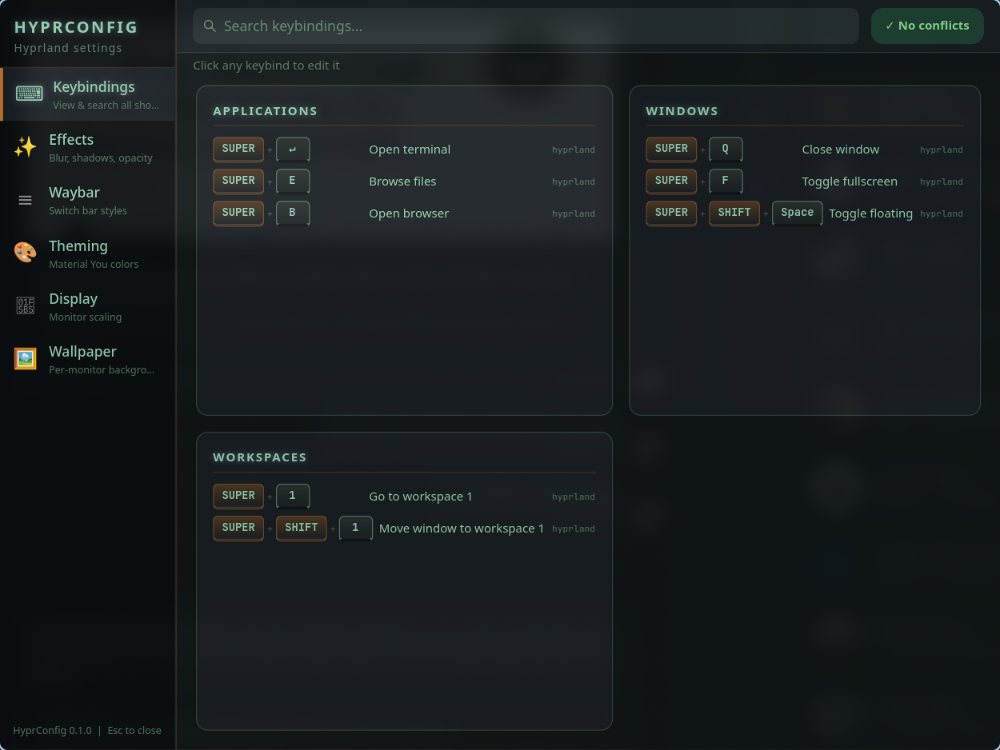

# HyprConfig

HyprConfig is a GTK4/libadwaita configuration companion for Hyprland. It puts
keybindings, visual effects, Waybar styles, color generation, displays, and
wallpapers in one native desktop application while continuing to use ordinary
Hyprland configuration files as the source of truth.



> [!WARNING]
> HyprConfig is pre-release software. Several actions rewrite sections of your
> Hyprland, Waybar, Rofi, Dunst, Fish, and wallpaper configuration. Writes are
> atomic and existing files are backed up, but keeping dotfiles under version
> control is still recommended.

## Features

- Searchable keybinding reference with conflict detection and editing
- Live blur, shadow, opacity, rounding, and animation controls
- Bundled Waybar layouts with an all-process, single-instance restart path
- Material You palettes generated by `matugen`
- Classic Gold and Matrix palette modes
- Per-monitor scaling through `hyprctl`
- Per-monitor wallpaper browsing and persistence through `swww`
- XDG-aware state and configurable Hyprland/Waybar paths
- Stock `hyprland.conf` source-graph and split-file configuration discovery
- Atomic configuration replacement with timestamped backups
- Migration from the former `~/.config/hyperconfig/state.json` location

## Status

HyprConfig targets Arch Linux with Hyprland and Waybar for its first public
alpha. Stock `hyprland.conf` source graphs and common split-file configurations
are supported. Optional integrations are detected at runtime. See the
[compatibility guide](docs/COMPATIBILITY.md) for the tested scope.

The project is licensed under [GPL-3.0-only](LICENSE). Bundled third-party
materials and their licenses are documented in [NOTICE](NOTICE) and
[Third-party attributions](docs/ATTRIBUTIONS.md).

## Quick start

On Arch Linux, install the core runtime dependencies:

```bash
sudo pacman -S python-gobject gtk4 libadwaita hyprland waybar
```

Optional integrations use `swww`, `matugen`, `rofi`, `dunst`, `foot`, `btop`,
`pavucontrol`, and NetworkManager tools.

HyprConfig does not install or replace your Hyprland configuration. Persistent
Hyprland settings are written to `~/.config/hypr/hyprconfig.conf`, which is
sourced from `hyprland.conf` on first use. Existing files are backed up below
`~/.config/hyprconfig/backups/` before replacement.

Install for the current user:

```bash
git clone https://github.com/ghreprimand/hyprconfig.git
cd hyprconfig
./install.sh
hyprconfig
```

For development without installation:

```bash
./scripts/dev
```

## Configuration layout

| Purpose | Default location |
|---|---|
| HyprConfig state | `~/.config/hyprconfig/state.json` |
| Recoverable backups | `~/.config/hyprconfig/backups/` |
| Managed Hyprland settings | `~/.config/hypr/hyprconfig.conf` |
| Hyprland files | `~/.config/hypr/` |
| Waybar files | `~/.config/waybar/` |
| Wallpaper library | `~/Pictures/walls/` |
| Installed application | `~/.local/share/hyprconfig/` |
| Launchers | `~/.local/bin/hyprconfig*` |

Paths honor XDG variables and the overrides documented in
[Configuration](docs/CONFIGURATION.md).

## Documentation

- [Installation](docs/INSTALLATION.md)
- [Compatibility](docs/COMPATIBILITY.md)
- [Configuration and path overrides](docs/CONFIGURATION.md)
- [Feature guide](docs/FEATURES.md)
- [Architecture](docs/ARCHITECTURE.md)
- [Development](docs/DEVELOPMENT.md)
- [Troubleshooting](docs/TROUBLESHOOTING.md)
- [Security model](SECURITY.md)
- [Third-party attributions](docs/ATTRIBUTIONS.md)
- [Public release assessment](docs/PUBLIC_RELEASE.md)
- [Roadmap](ROADMAP.md)
- [Contributing](CONTRIBUTING.md)
